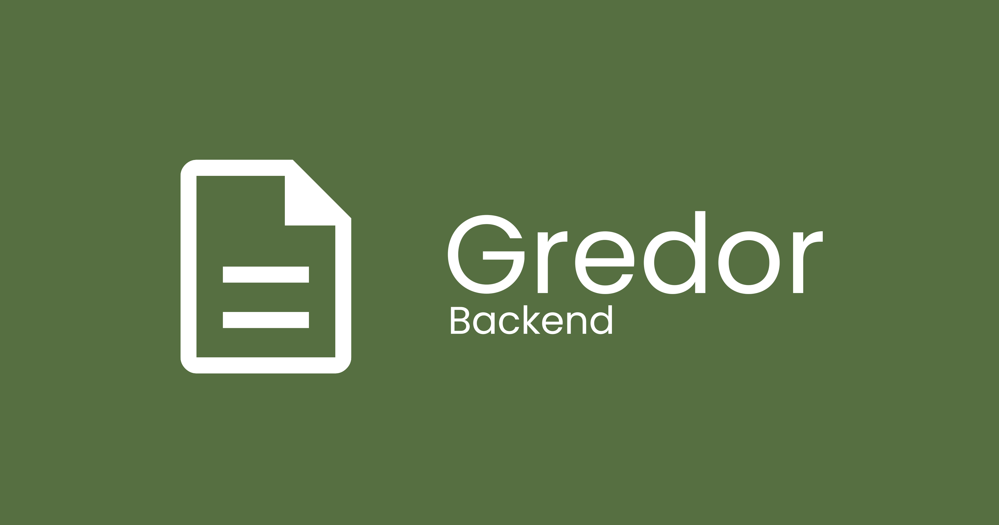

Gredor är ett kostnadsfritt webbaserat verktyg för att ta fram årsredovisningar
och skicka in dem till Bolagsverket i iXBRL-format. Verktyget har stöd för alla
delar i en vanlig K2-årsredovisning för aktiebolag utan revisor.

Backenden är Quarkus-baserad och byggd för att kunna köras i en container.

Applikationen är lite speciell på så sätt att frontenden innehåller i princip
all logik, och backenden används i princip bara för att kommunicera med
Bolagsverket och BankID. Detta för att utnyttja faktumet att iXBRL kan
integreras i XHTML och därmed byggas upp i webbläsaren med
live-förhandsgranskning.


## Köra Gredor-backenden lokalt

Sätt först följande miljövariabel:

```
GREDOR_DATABASE_PATH=<path till din sqlite-databas (filen skapas automatiskt)>
```

Kör sedan detta för att starta en utvecklingsserver:

```sh
./gradlew quarkusDev -Djava.net.preferIPv4Stack=true
```


## Bygga Gredor-backenden

Kör:

```sh
./gradlew build
```

När backenden sedan körs måste följande miljövariabler vara satta:

```
QUARKUS_PROFILE=<normalt "acc" eller "prod" beorende på miljötyp>
GREDOR_DATABASE_PATH=<path till din sqlite-databas (filen skapas automatiskt)>
GREDOR_SECRETS_CONFIG_PATH=<path till din gredor-secrets.yaml (se nedan)>
GREDOR_USE_X_REAL_IP=<"true" eller "false" beroende på om du har en proxy som skickar headern X-Real-IP framför Gredor>
```

Format på gredor-secrets.yaml:

```yaml
gredor:
  secrets:
    cert-bankid:
      path: <path till certifikatfilen>
      password: <lösenord till certifikatfilen>
    cert-bolagsverket:
      path: <path till certifikatfilen>
      password: <lösenord till certifikatfilen>
```


## Vill du bidra?

Bidrag till projektet uppskattas stort! Dock är det viktigt att tänka på att
t.ex. nya funktioner och förändringar måste passa bra med Gredor i övrigt. Om du
vill bidra med något större, öppna gärna en issue och/eller utkasts-PR för att
få tidig återkoppling på dina tänkta ändringar.


## Licens

Gredor distribueras under AGPLv3-licens, med en tilläggsklausul för friare
sammansättning med annan programvara.
